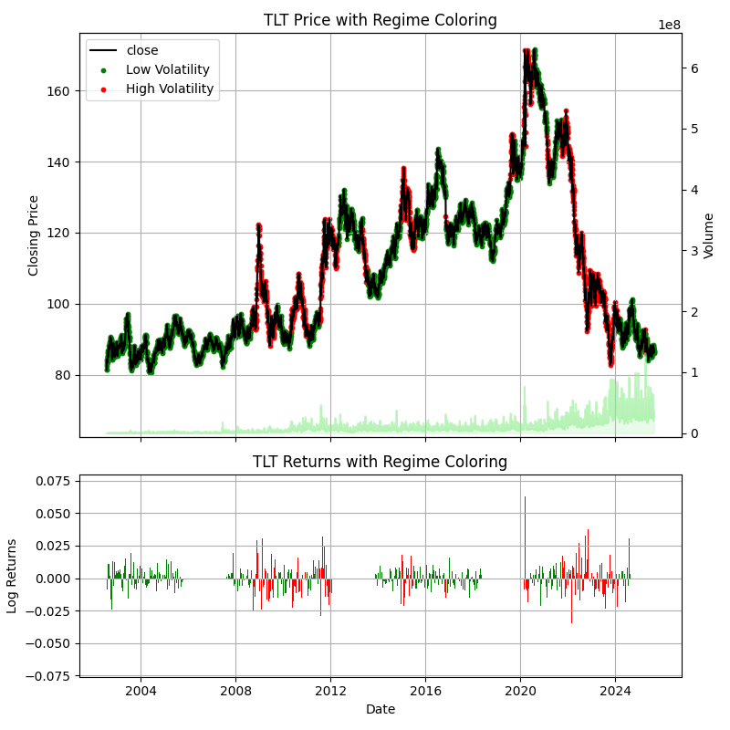
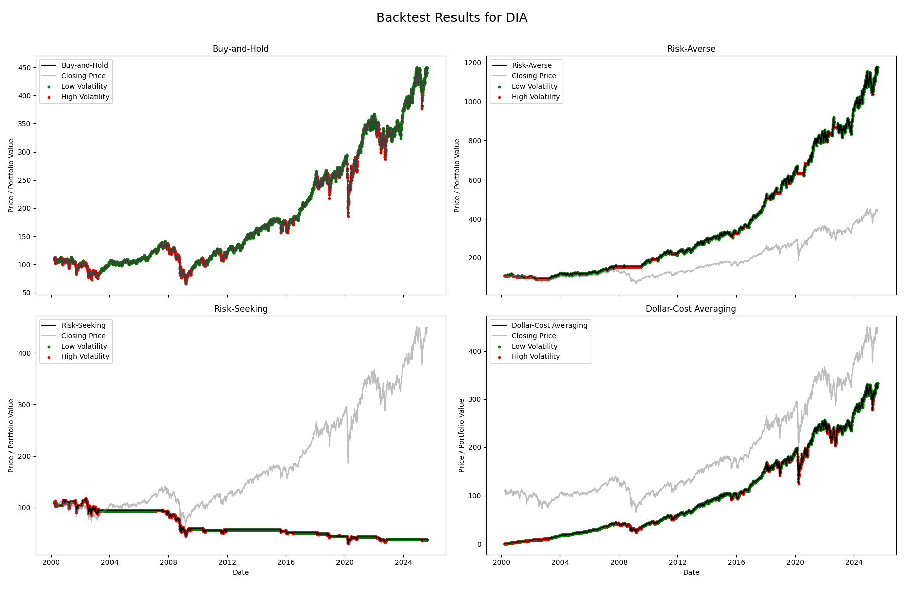
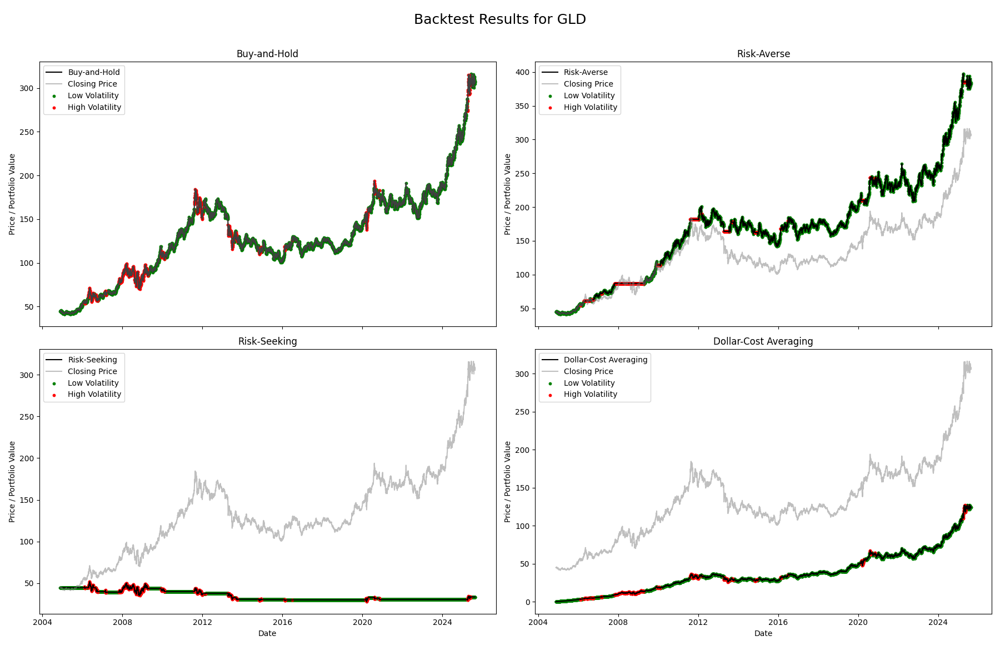
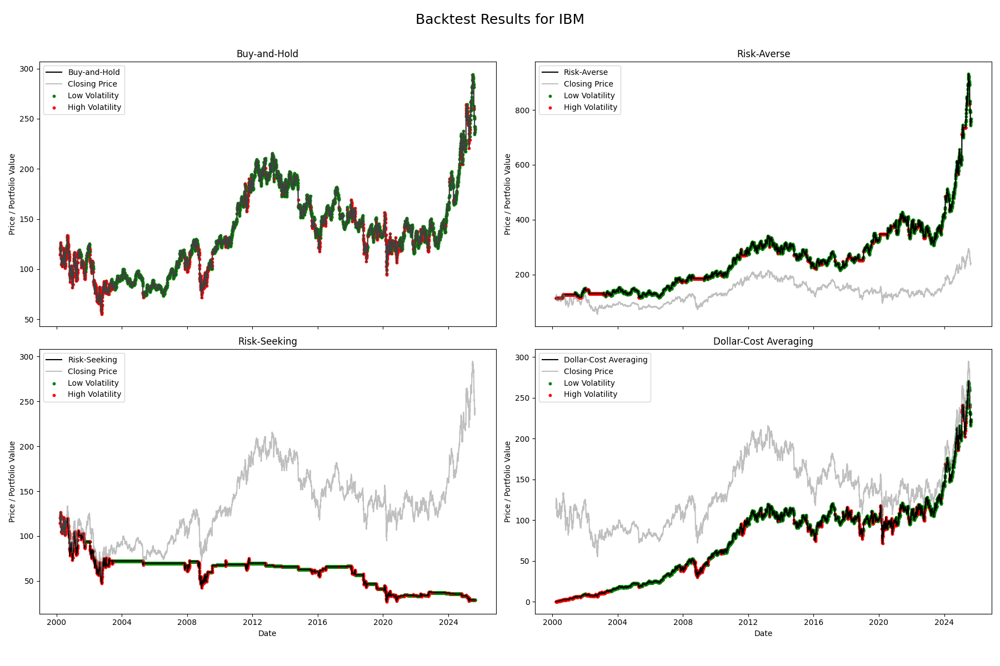
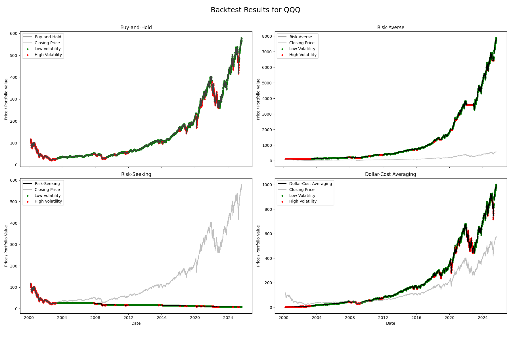
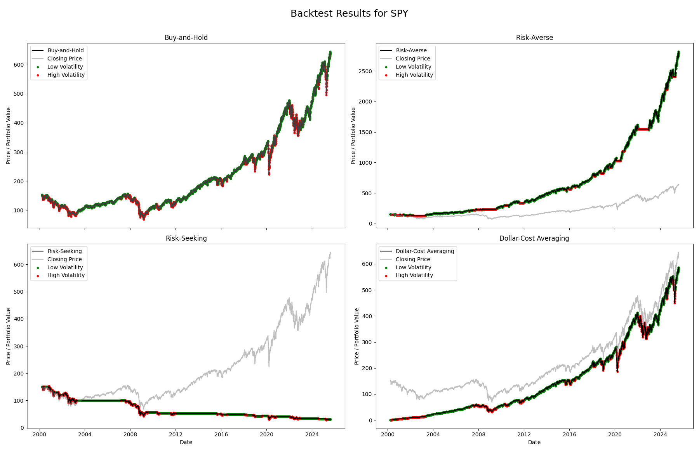
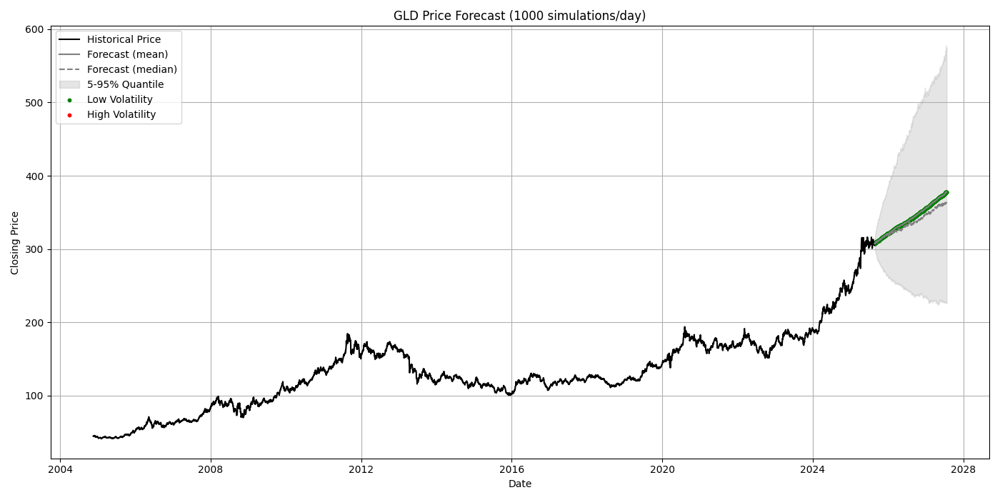
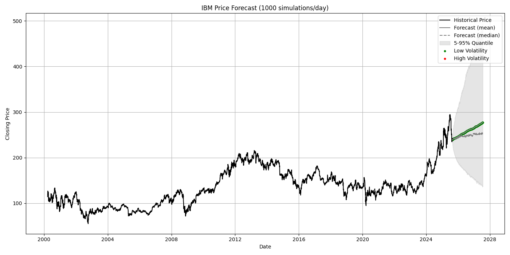
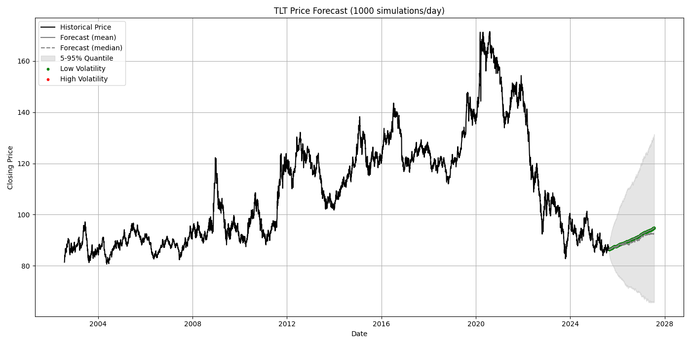

# Hidden Markov Models for Volatility-Aware Strategies

By Agastya Gaur  
August 2025

## Introduction

New traders often begin with widely recommended strategies that require minimal monitoring of daily market movements. While these approaches are not inherently flawed, introducing a modest level of strategy complexity can potentially enhance returns. Simple strategies, such as those that take into account volatility in the market, are an easily accessible next step for traders to grow their skills. This project aims to determine if taking this step into slightly more complex strategies would also yield noticeable improvements in returns.

To accomplish this, I trained a 2-state Gaussian Hidden Markov Model (HMM) on historical asset data to identify windows of low and high volatility, then backtested two "beginner" and two volatility-aware strategies to compare their outcome over a number of years.

The key research question is whether volatility-aware strategies can consistently outperform traditional beginner-friendly approaches, especially over long investment horizons where market regimes shift.

---

## Data and Preprocessing

A total of 8 assets were chosen for this project:

- **Indexes:** SPY, QQQ, DIA (Represent broad U.S. market exposure)
- **Stocks:** BRK.A, IBM, META (Provide examples of large-cap equities with varying volatility and sector exposure)
- **Commodities and Bonds:** GLD, TLT (Capture alternative asset classes that behave differently under stress)

This assured a broad sample of assets to test the strategies.  

**Note:** One limitation of my model was its inability to handle stock splits correctly. Therefore, I restricted the analysis to assets with little or no history of splits.  

Data was collected from AlphaVantage and included the following columns of daily data:

| Column Title    | Description                                                                |
|-----------------|----------------------------------------------------------------------------|
| `date`          | The date of the row data                                                   |
| `open`          | The opening price of the asset                                             |
| `high`          | The highest price of the asset                                             |
| `low`           | The lowest price of the asset                                              |
| `close`         | The closing price of the asset (used for returns)                          |
| `volume`        | The volume of the asset traded                                             |

For this project, I focused on **close-to-close daily returns**. Data preprocessing included:

- Removing duplicates and empty rows
- Converting empty strings to `NaN`  
- Casting all numerical values into float or integer types  
- Parsing all dates from string to datetime
- Removing any data before March 20, 2000 to avoid stock splits  

---

## Methodology

For each asset, simple and logarithmic returns were calculated (excluding the first day). The logarithmic returns were fed into a 2-state Gaussian HMM with the following parameters:

| Parameter | Used Value | Description |
|---|---|---|
| `train_frac` | `0.6` | Fraction of the data to use for model training |
| `n_iter` | `1000` | Number of iterations performed by the model for fitting |
| `seed` | `21` | Random seed for reproducability |

The 2-state Gaussian HMM was chosen due to the interpratibility of results by newer traders as well as its capability to distinguish between high and low volatility states.

The model outputs:

- Hidden states & state probabilities (low and high volatility)  
- Transition matrix  
- Mean and Variance data for each state  

**Final Dataset:**

After getting results from the model, the final dataset contained the following columns in addition to the original columns from the data:

| Column Title    | Description                                                                |
|-----------------|----------------------------------------------------------------------------|
| `low_vol_prob`  | Probability of the asset being in a low-volatility state on the given date |
| `high_vol_prob` | Probability of the asset being in a low-volatility state on the given date |
| `state`         | State of the asset (0 = low_vol, 1 = high_vol)                             |
| `simple_ret`    | Simple return from the previous day                                        |
| `log_ret`       | Logarithmic Return from the previous day                                   |

An example from the dataset for TLT:

| date | low_vol_prob | high_vol_prob | state | open | high | low | close | volume | simple_ret | log_ret |
|---|---|---|---|---|---|---|---|---|---|---|
| 2010-04-29 | 0.4791464688036577 | 0.5208535311948629 | 0 | 90.86 | 91.2225 | 90.52 | 91.08 | 4067200 | 0.0041896361631752 | 0.0041808840744478 |
| 2010-04-30 | 0.348648119323207 | 0.651351880676007 | 0 | 91.28 | 92.17 | 91.11 | 92.13 |6924800 | 0.011528326745718 | 0.0114623819253017 |
| 2010-05-03 | 0.24610484755502313 | 0.7538951524459493 | 0 | 91.42 | 92.02 | 91.28 | 91.69 | 4211800 | -0.0047758601975469 | -0.0047873010590312 |
| 2010-05-04 | 0.08936771295922045 | 0.9106322870400323 | 1 | 92.81 | 93.47 | 92.56 | 93.34 | 11054800 | 0.0179954193478024 | 0.0178354184598602 |
| 2010-05-05 | 0.053552482199500887 | 0.9464475178001164 | 1 | 94.06 | 94.85 | 93.35 | 93.89 |12219100 | 0.0058924362545531 | 0.0058751437487864 |
| 2010-05-06 | 0.0005024857235497041 | 0.999497514275762 | 1 | 94.16 | 100.0 | 93.78 | 96.79 | 19578200 | 0.0308872084354032 | 0.0304197988905412 |

---

### Visualizations

Graphs of the price and log returns for each asset, including regime colorings and the system's transition matrix:

**BRK.A:**

|  |  |  |
|---|---|---|
|| **Low** | **High** |
| **Low** | 0.9793016728134806 | 0.020698327186519472 |
| **High** | 0.08088766518658039 | 0.9191123348134196 |

**DIA:**

|  |  |  |
|---|---|---|
| | **Low** | **High** |
| **Low** | 0.9940068227080981 | 0.005993177291901875 |
| **High** | 0.01798460020332571 | 0.9820153997966743 |

**GLD:**

|  |  |  |
|---|---|---|
| | **Low** | **High** |
| **Low** | 0.9892374581708647 | 0.010762541829135337 |
| **High** | 0.035921152044868246 | 0.9640788479551318 |

**IBM:**

|  |  |  |
|---|---|---|
|| **Low** | **High** |
| **Low** | 0.9852084222060226 | 0.014791577793977365 |
| **High** | 0.04815306856358633 | 0.9518469314364137 |

**META:**

|  |  |  |
|---|---|---|
| | **Low** | **High** |
| **Low** | 0.9639726950017415 | 0.036027304998258514 |
| **High** | 0.14922216216275938 | 0.8507778378372406 |

**QQQ:**

|  |  |  |
|---|---|---|
| | **Low** | **High** |
| **Low** | 0.9965072027909997 | 0.0034927972090002626 |
| **High** | 0.010040484299280486 | 0.9899595157007195 |

**SPY:**

|  |  |  |
|---|---|---|
|  | **Low** | **High** |
| **Low** | 0.9928505940710867 | 0.007149405928913339 |
| **High** | 0.01968721268286422 | 0.9803127873171358 |

**TLT:**

|  |  |  |
|---|---|---|
|  | **Low** | **High** |
| **Low** | 0.9956434309314541 | 0.0043565690685459174 |
| **High** | 0.011831958720722067 | 0.9881680412792779 |

---

### Expected Regime Durations

| Asset | Low Volatility (days) | High Volatility (days) |
|-------|-------------------|--------------------|
| BRK.A | 48.4 | 12.4 |
| DIA   | 166.9 | 55.6 |
| GLD   | 93.0 | 27.8 |
| IBM   | 67.5 | 20.5 |
| META  | 27.8 | 6.7  |
| QQQ   | 285.7 | 99.5 |
| SPY   | 140.4 | 50.7 |
| TLT   | 225.6 | 84.6 |

---

### Analysis

In all cases, the model seemed to favor the Low Volatility State, expecting it to last longer than the high volatility state for every asset.

Furthermore, the transition matrices tended to be extremely sticky, assigning very high probabilities for the volatility to remain in the state it is already in, with a slight advantage to being in a low volatility state. In fact, most high volatility states were concentrated around 2001, 2008, and 2020, suggesting that it takes real world factors for the market to change volatility state.

It should be noted, however, that sticky transitions matrices are a common feature of financial time-series HMMs.

---

## Backtesting

### Strategies

With the regimes identified, four trading strategies were backtested.  
Each strategy began with **1 share (or equivalent fractional purchases in DCA)** at the start of the period. A transaction cost of 0.1% was applied for each buy/sell action.  

**Baseline Strategies:**

1. **Buy-and-Hold (B&H):** Buy a share at the beginning and hold until the end. Benchmark passive strategy, requires no regime awareness.
2. **Dollar-Cost Averaging (DCA):** Start with enough to buy 1 share, but only invest a fraction each day such that all the money is invested by the end. Reduces timing risk by spreading entry, but not volatility-adaptive.

**Volatility-Aware Strategies:**

1. **Risk-Averse:** Fully invested during low volatility; exit to cash during high volatility. Emphasizes capital preservation by avoiding turbulent markets.
2. **Risk-Seeking:** Fully invested during high volatility; exit to cash during low volatility. Attempts to capture outsized gains during volatility with the risk of high losses.

**Note:** Volatility-aware strategies had a reaction delay on one day for realism, e.g. if the market became volatile after a low volatility period, the risk-averse strategy would liquidate its assets the day after.

---

### Visualizations

---

### Metrics

To evaluate the effectiveness of each backtesting strategy, six standard performance metrics were applied. Together, they capture both absolute returns and risk-adjusted outcomes:

- **Final Value:** The ending portfolio value at the conclusion of the backtest. Provides a straightforward measure of overall profitability but does not account for risk.  
- **Total Log Return:** The cumulative logarithmic return relative to the initial investment. Useful for comparing growth across assets and strategies on a normalized scale.  
- **Annualized Volatility:** The yearly standard deviation of portfolio returns. Reflects the degree of variability and risk associated with the strategy.  
- **CAGR (Compound Annual Growth Rate):** The average annualized growth rate over the backtest horizon. Demonstrates how effectively the strategy generated sustained returns over time.  
- **Max Drawdown:** The largest peak-to-trough decline in portfolio value. Highlights the worst-case loss an investor would have faced.  
- **Calmar Ratio:** The ratio of CAGR to Max Drawdown. Serves as a risk-adjusted performance measure, rewarding strategies that balance high growth with limited drawdowns.  

**BRK.A:**

| **Strategy** | **Final Value ($)** | **Total Log Return (%)** | **Annualized Volatility (%)** | **CAGR (%)** | **Max Drawdown (%)** | **Calmar Ratio** |
|---|---|---|---|---|---|---|
| **Buy and Hold** | 731507.54 | 1237.31 | 21.36 | 10.76 | -51.5 | 0.209 |
| **Dollar Cost Averaging** | 290798.49 | 431.62 | 28.86 | 6.81 | -48.6 | 0.14 |
| **Risk Averse** | 338106.35 | 518.11 | 13.01 | 7.44 | -34.4 | 0.216 |
| **Risk Seeking** | 93924.87 | 71.71 | 16.95 | 2.15 | -50.7 | 0.042 |

**DIA:**

| **Strategy** | **Final Value ($)** | **Total Log Return (%)** | **Annualized Volatility (%)** | **CAGR (%)** | **Max Drawdown (%)** | **Calmar Ratio** |
|---|---|---|---|---|---|---|
| **Buy and Hold** | 448.91 | 313.36 | 18.45 | 5.75 | -53.8 | 0.107 |
| **Dollar Cost Averaging** | 332.92 | 206.56 | 26.78 | 4.52 | -45.5 | 0.099 |
| **Risk Averse** | 1176.76 | 983.58 | 10.39 | 9.85 | -20.7 | 0.476 |
| **Risk Seeking** | 37.67 | -65.31 | 15.25 | -4.09 | -75.0 | -0.055 |

**GLD:**

| **Strategy** | **Final Value ($)** | **Total Log Return (%)** | **Annualized Volatility (%)** | **CAGR (%)** | **Max Drawdown (%)** | **Calmar Ratio** |
|---|---|---|---|---|---|---|
| **Buy and Hold** | 306.98 | 585.54 | 17.57 | 9.74 | -45.6 | 0.214 |
| **Dollar Cost Averaging** | 124.06 | 177.04 | 27.78 | 5.04 | -30.0 | 0.168 |
| **Risk Averse** | 382.86 | 754.98 | 12.93 | 10.91 | -29.5 | 0.369 |
| **Risk Seeking** | 33.51 | -25.17 | 11.9 | -1.39 | -46.2 | -0.03 |

**IBM:**

| **Strategy** | **Final Value ($)** | **Total Log Return (%)** | **Annualized Volatility (%)** | **CAGR (%)** | **Max Drawdown (%)** | **Calmar Ratio** |
|---|---|---|---|---|---|---|
| **Buy and Hold** | 239.14 | 109.31 | 25.98 | 2.95 | -58.8 | 0.05 |
| **Dollar Cost Averaging** | 220.21 | 92.75 | 32.54 | 2.62 | -42.8 | 0.061 |
| **Risk Averse** | 757.46 | 562.98 | 16.81 | 7.74 | -36.5 | 0.212 |
| **Risk Seeking** | 28.86 | -74.74 | 19.83 | -5.28 | -78.7 | -0.067 |

**META:**

| **Strategy** | **Final Value ($)** | **Total Log Return (%)** | **Annualized Volatility (%)** | **CAGR (%)** | **Max Drawdown (%)** | **Calmar Ratio** |
|---|---|---|---|---|---|---|
| **Buy and Hold** | 746.97 | 2095.04 | 39.82 | 26.31 | -76.7 | 0.343 |
| **Dollar Cost Averaging** | 248.65 | 630.67 | 47.76 | 16.23 | -75.6 | 0.215 |
| **Risk Averse** | 1816.25 | 5237.2 | 26.06 | 35.09 | -38.5 | 0.912 |
| **Risk Seeking** | 11.11 | -67.36 | 30.08 | -8.12 | -80.2 | -0.101 |

**QQQ:**

| **Strategy** | **Final Value ($)** | **Total Log Return (%)** | **Annualized Volatility (%)** | **CAGR (%)** | **Max Drawdown (%)** | **Calmar Ratio** |
|---|---|---|---|---|---|---|
| **Buy and Hold** | 565.33 | 395.91 | 26.57 | 6.52 | -83.0 | 0.079 |
| **Dollar Cost Averaging** | 977.53 | 757.48 | 32.65 | 8.84 | -47.8 | 0.185 |
| **Risk Averse** | 7697.4 | 6652.11 | 14.28 | 18.07 | -17.4 | 1.04 |
| **Risk Seeking** | 7.8 | -93.16 | 22.38 | -10.03 | -94.2 | -0.107 |

**SPY:**

| **Strategy** | **Final Value ($)** | **Total Log Return (%)** | **Annualized Volatility (%)** | **CAGR (%)** | **Max Drawdown (%)** | **Calmar Ratio** |
|---|---|---|---|---|---|---|
| **Buy and Hold** | 637.47 | 324.72 | 19.44 | 5.87 | -56.5 | 0.104 |
| **Dollar Cost Averaging** | 580.35 | 286.66 | 27.45 | 5.48 | -48.2 | 0.114 |
| **Risk Averse** | 2788.44 | 1757.8 | 10.63 | 12.21 | -16.7 | 0.733 |
| **Risk Seeking** | 31.02 | -79.34 | 16.27 | -6.03 | -81.7 | -0.074 |

**TLT:**

| **Strategy** | **Final Value ($)** | **Total Log Return (%)** | **Annualized Volatility (%)** | **CAGR (%)** | **Max Drawdown (%)** | **Calmar Ratio** |
|---|---|---|---|---|---|---|
| **Buy and Hold** | 86.32 | 6.02 | 14.47 | 0.25 | -51.8 | 0.005 |
| **Dollar Cost Averaging** | 66.51 | -18.32 | 25.18 | -0.87 | -44.5 | -0.02 |
| **Risk Averse** | 142.19 | 74.64 | 9.8 | 2.45 | -20.5 | 0.119 |
| **Risk Seeking** | 47.25 | -41.96 | 10.65 | -2.33 | -57.9 | -0.04 |

---

### Analysis

The backtesting results highlight clear distinctions in performance across the four strategies:

- **Risk-Averse:** This strategy consistently delivered the strongest risk-adjusted outcomes. Although it did not always achieve the absolute highest returns—owing to missed gains during high-volatility periods—it reliably generated positive performance with comparatively low volatility. As a result, it achieved the highest Calmar Ratios across most assets, underscoring its effectiveness in balancing growth with capital preservation.  

- **Buy-and-Hold:** Performance closely tracked the long-term trajectory of the underlying assets. While generally producing solid positive returns, this strategy exhibited greater exposure to drawdowns compared to the risk-averse approach. It remains a viable baseline, but offered less stability and, in most cases, weaker efficiency in terms of risk-adjusted performance.  

- **Dollar-Cost Averaging:** This method consistently underperformed relative to Buy-and-Hold. While the staggered investment schedule helped cushion the impact of market downturns, it also diminished the benefits of early compounding. Over extended horizons, this trade-off resulted in lower final returns and weaker overall growth efficiency.  

- **Risk-Seeking:** This was the weakest of the four strategies. Although occasional high-volatility periods generated short-term gains, these were typically erased by subsequent losses. The results reinforce the notion that heightened market volatility is more often associated with elevated risk of drawdowns rather than sustained opportunity for excess returns.  

---

## Forecasting with HMM

To extend the analysis, I tested whether HMM state probabilities could be used for forward-looking regime prediction and volatility-aware strategy evaluation via Monte Carlo simulation.

I generated 1,000 forecast paths beginning at the last observation in the dataset. At each timestep, state probabilities were updated by multiplying the previous probabilities with the HMM transition matrix. For each path, a regime (low- or high-volatility) was then sampled based on these probabilities.

The return for the next day was drawn from a normal distribution corresponding to the chosen state's estimated mean and standard deviation (as learned by the HMM). This return was applied to the previous day’s price to update that path.

After simulating all paths for a given timestep, I computed the mean, median, and the 5th and 95th percentile prices across the ensemble to summarize the forecast distribution.

The process was then repeated for subsequent timesteps, with each path evolving forward from its own prior simulated price.

### Visualizations

**Findings:**

Clearly, the forecasts were very general, with all of them defaulting to a low-volatility state with very high uncertainty after only a short period of time.

The clear trend is that the model predicts the market to continuously increase over time, barring any world events that it could not predict. This general trend is true, though point predictions were unreliable.

It is also possible that a simple 2-state Gaussian HMM is too much of an oversimplification to accurately point predict the market. HMMs are not typically used for this purpose, and as expected, they were unable to offer any insight other than that the market will steadily increase if it does not experience any shocks from real world factors.

---

## Discussion

This project demonstrated that Hidden Markov Models can successfully identify volatility regimes in financial assets and that incorporating these regimes into trading strategies leads to tangible differences in performance. The main findings were:

- **Volatility Regimes:** The HMM consistently identified persistent low-volatility states, with high-volatility states clustering around major financial crises (2001, 2008, 2020). Transition matrices were extremely "sticky," suggesting regimes are long-lasting and only shift under external shocks.
- **Strategy Performance:**  
  - **Risk-Averse** strategies were the strongest overall, producing the highest Calmar Ratios and combining solid growth with controlled risk.  
  - **Buy-and-Hold** remained a competitive baseline but was less efficient in balancing growth against drawdowns.  
  - **Dollar-Cost Averaging** underperformed relative to Buy-and-Hold, suggesting that spreading entry timing did not compensate for foregone compounding.  
  - **Risk-Seeking** strategies were consistently the weakest, experiencing catastrophic drawdowns and poor long-term performance.
- **Forecasting:** Using HMMs for forward-looking prediction proved limited. Simulations quickly defaulted to low-volatility states with widening uncertainty bands, confirming that the model is more useful for retrospective regime classification than for prospective forecasting.

Overall, the evidence supports the conclusion that **volatility-aware strategies can outperform traditional beginner approaches over long horizons if employed correctly**, but predictive use of HMMs remains constrained by their structural limitations.

---

## Future Work

Several directions could improve both the modeling and strategy evaluation:

- Test shorter horizons (e.g., intraday data) → to evaluate whether volatility-aware strategies hold under high-frequency conditions where the returns are more random.

- Expand to 3- or 4-state HMMs → to differentiate between moderate and extreme volatility regimes.

- Compare with alternative regime-switching models (e.g., Markov-Switching GARCH).
