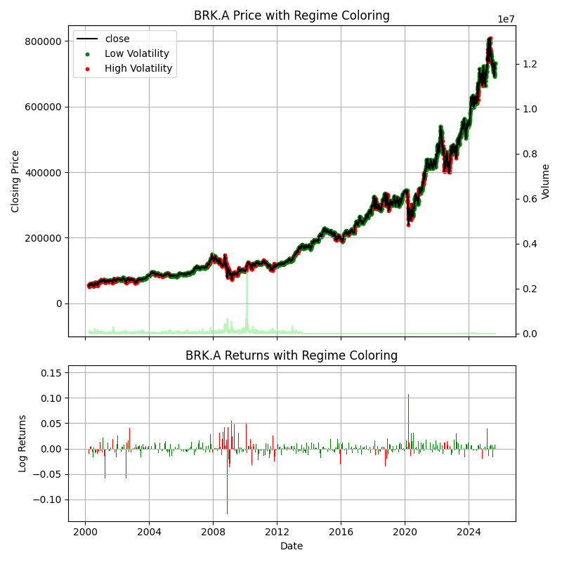
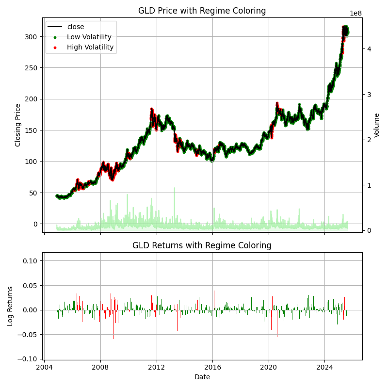
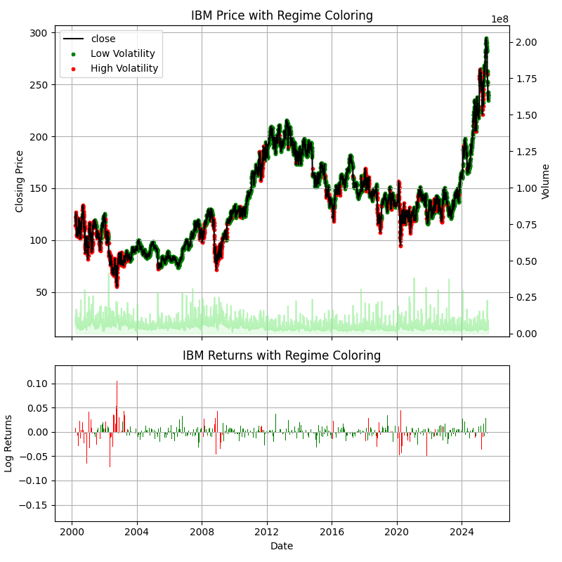
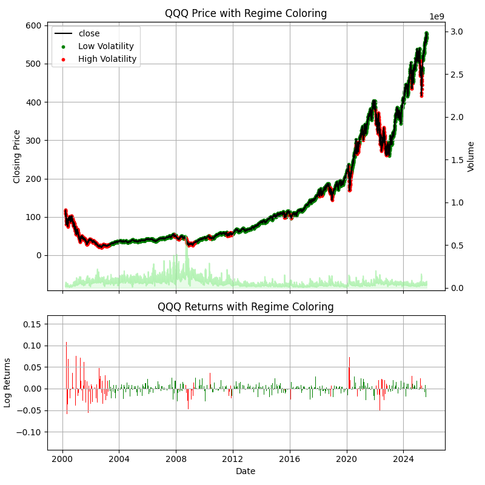

# Hidden Markov Models for Volatility-Aware Strategies

By Agastya Gaur  
August 2025

## Introduction

In this project, I trained a 2-state Gaussian Hidden Markov Model (HMM) on historical asset data to identify windows of low and high volatility.  
The choice of a 2-state model was deliberate: categorizing periods as either calm or turbulent provides an intuitive concept for beginners in trading. Markets often oscillate between “quiet” and “volatile” regimes, making regime-switching models especially useful.  

**Research Question:**  
Do volatility-aware strategies outperform “beginner” strategies over long periods of time?

---

## Data and Preprocessing

A total of 8 assets were chosen for this project:

- **Indexes:** SPY, QQQ, DIA  
- **Stocks:** BRK.A, IBM, META  
- **Commodities and Bonds:** GLD, TLT  

This assures a broad sample of assets to test the strategies.  

**Note:** One limitation of my model was its inability to handle stock splits correctly. Therefore, I restricted the analysis to assets with little or no history of splits.  

Data was collected from AlphaVantage and included the following columns of daily data:

| Column Title    | Description                                                                |
|-----------------|----------------------------------------------------------------------------|
| `date`          | The date of the row data                                                   |
| `open`          | The opening price of the asset                                             |
| `high`          | The highest price of the asset                                             |
| `low`           | The lowest price of the asset                                              |
| `close`         | The closing price of the asset (used for returns)                          |
| `volume`        | The volume of the asset traded                                             |

For this project, I focused on **close-to-close daily returns**. Data preprocessing included:

- Removing duplicates and empty rows  
- Converting empty strings to `NaN`  
- Casting all numerical values into float or integer types  
- Parsing all dates from string to datetime
- Removing any data before March 20, 2000 to avoid any stock splits  

---

## Methodology

### Returns

For each asset, simple and logarithmic returns were calculated (excluding the first day):

- **Simple Return:**
  
$$
R_t = \frac{P_t - P_{t-1}}{P_{t-1}}
$$

- **Logarithmic Return:**
  
$$
r_t = \ln\left(\frac{P_t}{P_{t-1}}\right)
$$

where $( P_t )$ is the closing price at time $( t )$.  

---

### Hidden Markov Model

The logarithmic returns were fed into a 2-state Gaussian HMM with the following parameters:

| Parameter | Used Value | Description |
|---|---|---|
| `train_frac` | `0.6` | Fraction of the data to use for model training |
| `n_iter` | `1000` | Number of iterations performed by the model for fitting |
| `seed` | `21` | Random seed for reproducability |

The model outputs:

- Hidden states & state probabilities (low and high volatility)  
- Transition matrix  
- Mean and Variance data for each state  

**Final Dataset:**

After getting results from the model, the final dataset contained the following columns in addition to the original columns from the data:

| Column Title    | Description                                                                |
|-----------------|----------------------------------------------------------------------------|
| `low_vol_prob`  | Probability of the asset being in a low-volatility state on the given date |
| `high_vol_prob` | Probability of the asset being in a low-volatility state on the given date |
| `state`         | State of the asset (0 = low_vol, 1 = high_vol)                             |
| `simple_ret`    | Simple return from the previous day                                        |
| `log_ret`       | Logarithmic Return from the previous day                                   |

An example from the dataset for TLT:

| date | low_vol_prob | high_vol_prob | state | open | high | low | close | volume | simple_ret | log_ret |
|---|---|---|---|---|---|---|---|---|---|---|
| `2010-04-29` | `0.4791464688036577` | `0.5208535311948629` | `0` | `90.86` | `91.2225` | `90.52` | `91.08` | `4067200` | `0.0041896361631752` | `0.0041808840744478` |
| `2010-04-30` | `0.348648119323207` | `0.651351880676007` | `0` | `91.28` | `92.17` | `91.11` | `92.13` | `6924800` | `0.011528326745718` | `0.0114623819253017` |
| `2010-05-03` | `0.24610484755502313` | `0.7538951524459493` | `0` | `91.42` | `92.02` | `91.28` | `91.69` | `4211800` | `-0.0047758601975469` | `-0.0047873010590312` |
| `2010-05-04` | `0.08936771295922045` | `0.9106322870400323` | `1` | `92.81` | `93.47` | `92.56` | `93.34` | `11054800` | `0.0179954193478024` | `0.0178354184598602` |
| `2010-05-05` | `0.053552482199500887` | `0.9464475178001164` | `1` | `94.06` | `94.85` | `93.35` | `93.89` | `12219100` | `0.0058924362545531` | `0.0058751437487864` |
| `2010-05-06` | `0.0005024857235497041` | `0.999497514275762` | `1` | `94.16` | `100.0` | `93.78` | `96.79` | `19578200` | `0.0308872084354032` | `0.0304197988905412` |

**Transition matrix:**

$$
T =
\begin{bmatrix}
P(L \to L) & P(L \to H) \\
P(H \to L) & P(H \to H)
\end{bmatrix}
$$

where $( L )$ = low volatility, $( H )$ = high volatility.  

**Expected regime duration:**

$$
\text{Expected duration in state } i = \frac{1}{1 - P(i \to i)}
$$

---

### Visualizations

Graphs of the price and log returns for each asset, including regime colorings, transition matrices, and expected regime durations:

**BRK.A**

|  |  |  |
|---|---|---|
|| **Low** | **High** |
| **Low** | 0.9793016728134806 | 0.020698327186519472 |
| **High** | 0.08088766518658039 | 0.9191123348134196 |

**DIA**

|  |  |  |
|---|---|---|
| | **Low** | **High** |
| **Low** | 0.9940068227080981 | 0.005993177291901875 |
| **High** | 0.01798460020332571 | 0.9820153997966743 |

**GLD**

|  |  |  |
|---|---|---|
| | **Low** | **High** |
| **Low** | 0.9892374581708647 | 0.010762541829135337 |
| **High** | 0.035921152044868246 | 0.9640788479551318 |

**IBM**

|  |  |  |
|---|---|---|
|| **Low** | **High** |
| **Low** | 0.9852084222060226 | 0.014791577793977365 |
| **High** | 0.04815306856358633 | 0.9518469314364137 |

**META**

|  |  |  |
|---|---|---|
| | **Low** | **High** |
| **Low** | 0.9639726950017415 | 0.036027304998258514 |
| **High** | 0.14922216216275938 | 0.8507778378372406 |

**QQQ**

|  |  |  |
|---|---|---|
| | **Low** | **High** |
| **Low** | 0.9965072027909997 | 0.0034927972090002626 |
| **High** | 0.010040484299280486 | 0.9899595157007195 |

**SPY**

|  |  |  |
|---|---|---|
|  | **Low** | **High** |
| **Low** | 0.9928505940710867 | 0.007149405928913339 |
| **High** | 0.01968721268286422 | 0.9803127873171358 |

**TLT**

|  |  |  |
|---|---|---|
|  | **Low** | **High** |
| **Low** | 0.9956434309314541 | 0.0043565690685459174 |
| **High** | 0.011831958720722067 | 0.9881680412792779 |

---

### Expected Regime Durations

| Asset | Low Regime (days) | High Regime (days) |
|-------|-------------------|--------------------|
| BRK.A | 48.4 | 12.4 |
| DIA   | 166.9 | 55.6 |
| GLD   | 93.0 | 27.8 |
| IBM   | 67.5 | 20.5 |
| META  | 27.8 | 6.7  |
| QQQ   | 285.7 | 99.5 |
| SPY   | 140.4 | 50.7 |
| TLT   | 225.6 | 84.6 |

---

### Analysis

yadda yadda

---

## Backtesting

### Strategies

With the regimes identified, four trading strategies were backtested.  
Each strategy began with **1 share (or equivalent fractional purchases in DCA)** at the start of the period. A transaction cost of 0.1% was applied for each buy/sell action.  

**Baseline Strategies:**

1. **Buy-and-Hold (B&H):** Buy a share at the beginning and hold until the end.  
2. **Dollar-Cost Averaging (DCA):** Start with enough to buy 1 share, but only invest a fraction each day such that all the money is invested by the end.

**Volatility-Aware Strategies:**

1. **Risk-Averse:** Fully invested during low volatility; exit to cash during high volatility.  
2. **Risk-Seeking:** Fully invested during high volatility; exit to cash during low volatility.  

---

### Visualizations

---

### Performance Metrics

The following metrics were used to evaluate performance:

- **Final Value (FV):**

$$
FV = \text{Portfolio value at final date}
$$

- **Log Return:**
  
$$
R_{\text{log}} = \ln\left(\frac{FV}{IV}\right)
$$

- **Compound Annual Growth Rate (CAGR):**
  
$$
CAGR = \left(\frac{FV}{IV}\right)^{\frac{1}{Y}} - 1
$$

where $( IV )$ = initial value, $( Y )$ = number of years.  

- **Maximum Drawdown (MDD):**

$$
MDD = \max_{t} \left( \frac{\text{Peak}_t - \text{Trough}_t}{\text{Peak}_t} \right)
$$

- **Calmar Ratio:**

$$
\text{Calmar} = \frac{CAGR}{MDD}
$$

---

### Tables and Graphs

- [Insert table of results: FV, log return, CAGR, MDD, Calmar Ratio by asset and strategy]  
- [Insert portfolio value plots comparing all 4 strategies per asset]  

---

### Analysis

Preliminary results suggest:

- **Risk-Averse** produced the strongest performance.  
- **Buy-and-Hold** followed closely.  
- **Dollar-Cost Averaging** underperformed relative to Buy-and-Hold.  
- **Risk-Seeking** was the weakest strategy.

---

## Forecasting with HMM

To extend the analysis, I tested whether HMM state probabilities could be used for forward-looking regime prediction and volatility-aware strategy evaluation via Monte Carlo simulation.

I generated 1,000 forecast paths beginning at the last observation in the dataset. At each timestep, state probabilities were updated by multiplying the previous probabilities with the HMM transition matrix. For each path, a regime (low- or high-volatility) was then sampled based on these probabilities.

The return for the next day was drawn from a normal distribution corresponding to the chosen state's estimated mean and standard deviation (as learned by the HMM). This return was applied to the previous day’s price to update that path.

After simulating all paths for a given timestep, I computed the mean, median, and the 5th and 95th percentile prices across the ensemble to summarize the forecast distribution.

The process was then repeated for subsequent timesteps, with each path evolving forward from its own prior simulated price.

[Insert graphs of forecasts here]

**Findings:**

- Point predictions were unreliable due to oversimplification from the 2-state model.  
- Transition matrices tended to be “sticky,” causing the system to fall into long equilibrium states without capturing the actual regime switching observed in real data.  
- Forecasting cannot account for exogenous real-world shocks (e.g., earnings surprises, geopolitical events).  

---

## Discussion

Key limitations:  

- A 2-state model may oversimplify market dynamics.  
- Forecast accuracy was hindered by sticky transition probabilities.  
- The model works retrospectively but struggles prospectively.  

Nevertheless, results suggest that incorporating volatility regimes can improve trading strategies compared to baseline methods.  

---

## Future Work

- Test shorter time horizons (e.g., intraday or minute-level data).  
- Expand to 3- or 4-state Gaussian HMMs to capture finer regimes.  
- Compare with alternative regime-switching models (e.g., Markov-Switching GARCH).  
- Incorporate transaction cost sensitivity analysis.  
- Explore reinforcement learning approaches to adapt strategies dynamically.  

---
